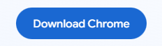
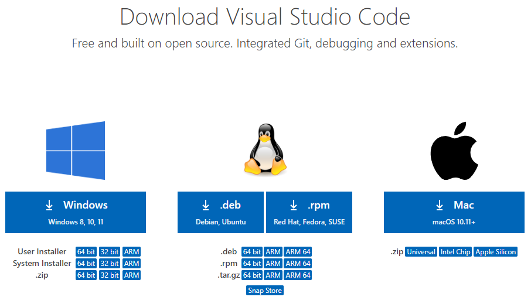
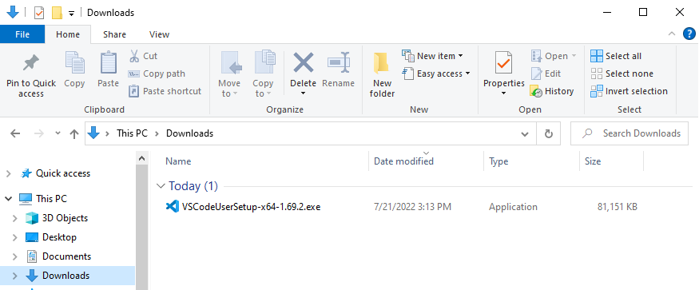
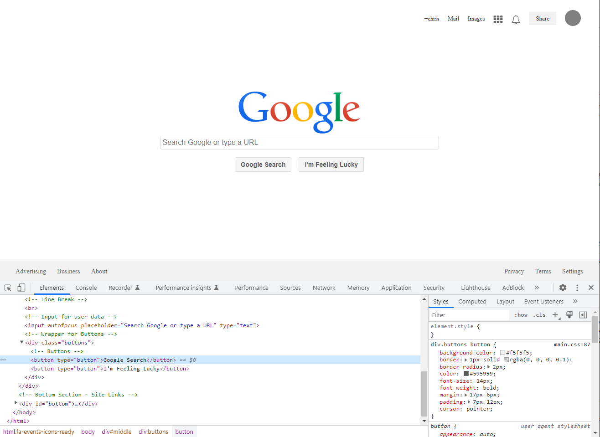
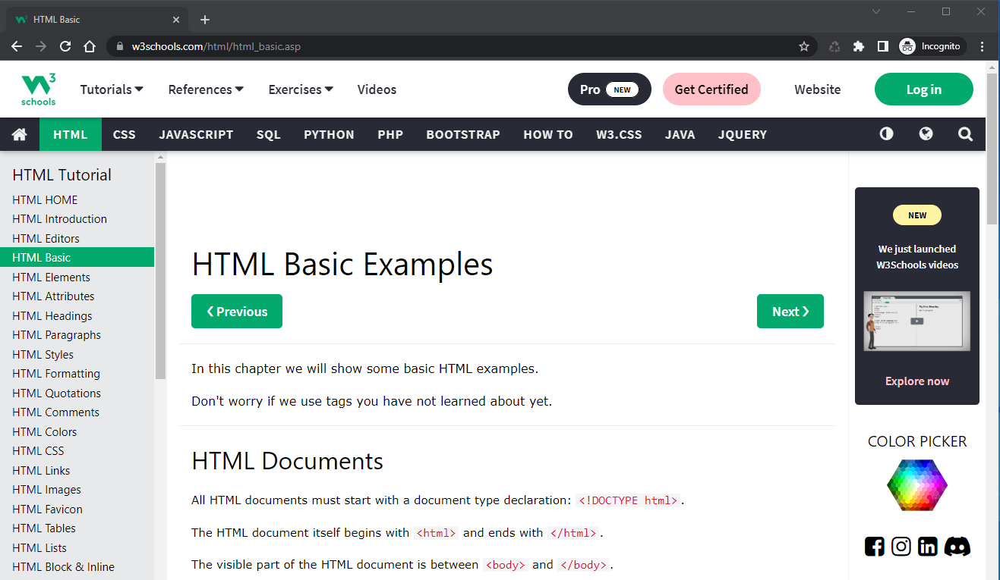
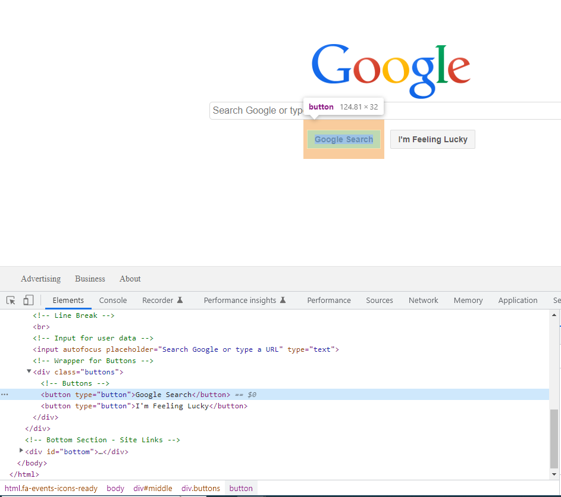
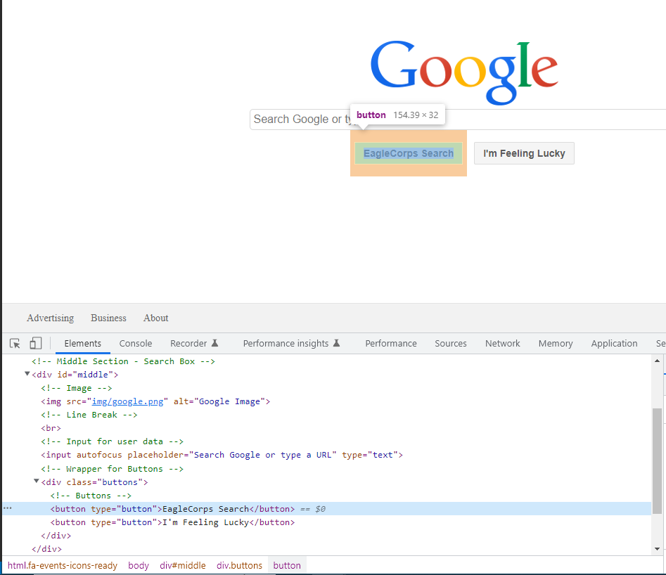
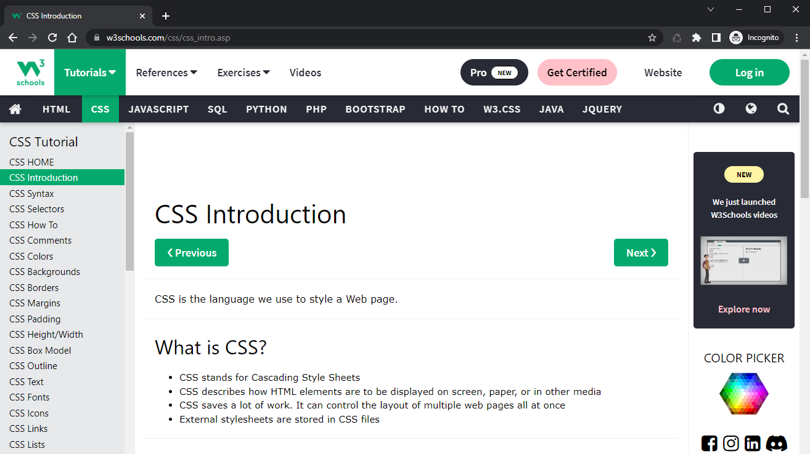

# **EAGLECORPS** [Full Stack Track](../README.md)
[back to Introduction Courses](/course/introduction.md)
# Developer Tools - Introduction Course #1 

## Course Objective: <br />
<em><b>Begin learning about tools for Full Stack Developers</b></em>

## Key Learning Objectives
+ [Download Google Chrome Web Browser and Visual Studio Code Text Editor](#step1)
+ [Learn how to inspect elements and modify code in the browser](#step2)
+ [Download and review what a HTML5 boilerplate is](#step3)
+ [Create a Github account and upload a boilerplate template](#step4)
+ [Complete the first coding project and upload it to Github](#step5)

<hr />

### <span id="step1">Learning Objective # 1</span> Download Google Chrome Web Browser and Visual Studio Code Text Editor
google image here<br />


+ [Download Chrome Web Browser](#step1.1)
+ [Execute ChromeSetup.exe](#step1.2)
+ [Download Visual Studio Code text editor](#step1.3)
+ [Execute VSCodeUserSetup.exe](#step1.4)
+ [Open the Google Replica Project in Chrome](#step1.5)


<div id="step1.1" class="step">Step 1:</div>
Visit the <a href="https://www.google.com/chrome/downloads/" target="_blank">Chrome Web Browser Download</a> page and select Download Chrome



<div id="step1.2" class="step">Step 2:</div>
Execute the ChromeSetup.exe file from the downloads folder


<div id="step1.3" class="step">Step 3:</div>
Visit the <a href="https://code.visualstudio.com/Download" target="_blank">Visual Studio Code</a> page and select your OS to download



<div id="step1.4" class="step">Step 4:</div>
Execute the VSCodeUserSetup.exe file from the downloads folder



<div id="step1.5" class="step">Step 5:</div>
Once VSC is on your computer navigate to <a href="#" target="_blank">This Google Project (needs to be provided)</a>

**NEED TO UPDATE IMAGE & URL TO PROPER PROJECT URL**
<!--  -->

<br />
<hr>

### <span id="step2">Learning Objective # 2</span> Learn how to inspect elements and modify code in the browser
+ [Inspect element to bring up developer tools](#step2.1)
+ [Discuss how to create an HTML element](#step2.2)
+ [Modify the HTML in browser](#step2.3)
+ [Discuss how CSS selects HTML and how property:value pairs work](#step2.4)
+ [Change CSS property:values pairs and add a few property:value pairs](#step2.5)

<div id="step2.1" class="step">Step 1: Inspect element to bring up developer tools</div> 

With the URL open, right-click on an element (or a blank area) and select <em>"Inspect"</em> or <em>"Inspect Element"</em> to bring up the developer console, we'll use this to see what elements are made of.  Notice HTML Elements on the left, and based on the element selected (highlighted in blue), you'll notice the correlating CSS on the right.


<div id="step2.2" class="step">Step 2: Discuss how to create an HTML element</div>
We need to checkout the #1 resource for creating HTML - <a href="https://www.w3schools.com/html/html_intro.asp" target="_blank">W3Schools</a> as it will be our go to for all things HTML

Here we can see: An HTML element is defined by a start tag, some content, and an end tag: 

```HTML
<tagname> Content goes here... </tagname>
```

The HTML element is everything from the start tag to the end tag:

```HTML
<h1>My First Heading</h1>
<p>My First Paragraph</p>
```
Elements to become familiar with using W3Schools:

!DOCTYPE | html | head  | link | script | body | div | ul | li | a | img | br | input

<div id="step2.3" class="step">Step 3: Modify the HTML in browser</div>
The browser allows us to select HTML and view the CSS the corresponds to create the style, we can also edit HTML or CSS and see the results right away, when the page is refreshed all changes will be reset. 

<br />Here you can see the button element with the text of "Google Search" is highlighted in the developer console


<br/>Double click the text "Google Search" in the highlighted button element and change the text you'll see it updates like magic!



<div id="step2.4" class="step">Step 4: Discuss how CSS selects HTML and how property:value pairs work</div>
Again we need to checkout the #1 resource - <a href="https://www.w3schools.com/css/css_intro.asp" target="_blank">W3Schools</a> as it will be our go to for all things CSS. For now we will become familiar the CSS element selector, #id selector and .class selector


<div id="step2.5" class="step">Step 5: Change CSS property:values pairs and add a few property:value pairs</div>

Here we can see: A CSS selector is defined by what elements you want to select in HTML, a property to change like background-color or margin and a value like green or 25px

```CSS
selector {  
    property:value;
}
```

Common CSS selectors

```CSS
/* CSS Element selector */
div {
    background:green;
}
/* CSS ID selector */
#events {
    text-align:center;
}
/* CSS Class selector */
.box {
    margin: 25px;
}
/* CSS pseudo selector */
a:hover {
    color:black;
    text-decoration:underline;
}

```

CSS Properties to become familiar with using W3Schools:

background | border | border-color | border-radius | color | cursor | display | float | font-size | font-weight | height | letter-spacing | line-height | list-style | margin | opacity | padding | position | text-align | text-decoration | width

<br />
<hr>
<br />

### <span id="step3">Learning Objective # 3</span> Download and review what a HTML boilerplate is
+ [Visit provided URL to download EagleCorps HTML Boilerplate](#step3.1)
+ [Uncomress/Unzip folder and open in VSC](#step3.2)
+ [Review the boilerplate and discuss how it can be reused](#step3.3)
+ [Discuss how CSS selects HTML and how property:value pairs work](#step3.4)

<div id="step3.1">Step 1: Visit provided URL to download EagleCorps HTML Boilerplate</div> 

<!--  -->

<div id="step3.2">Step 2: Uncomress/Unzip folder and open in VSC</div> 

<div id="step3.3">Step 3: Review the boilerplate and discuss how it can be reused</div> 

<div id="step3.4">Step 4: Make some changes and view using live view in VSC</div> 

<br />
<hr>
<br />

### <span id="step4">Learning Objective # 4</span> Create a Github account and upload the boilerplate template
+ [Review what Github is, and how to use it](#step4.1)
+ [Create a Github account and add credentials to upload projects](#step4.2)

<div id="step4.1">Step 1: Review what Github is, and how to use it</div>
<div id="step4.2">Step 2: Create a Github account and add credentials to upload projects</div>

<br />
<hr>
<br />

### <span id="step5">Learning Objective # 5</span> Complete the first coding project and upload it to Github
+ [Visit provided URL to view the first coding project](#step5.1)
+ [Check your environment setup before beginning the replication ](#step5.2)

<div id="step5.1">Step 1: </div>
<div id="step5.2">Step 2: </div>
