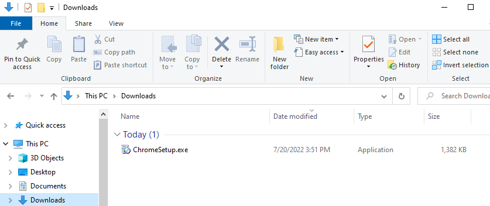
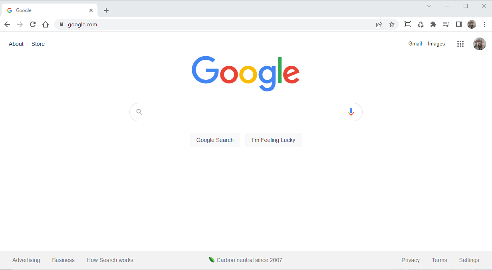
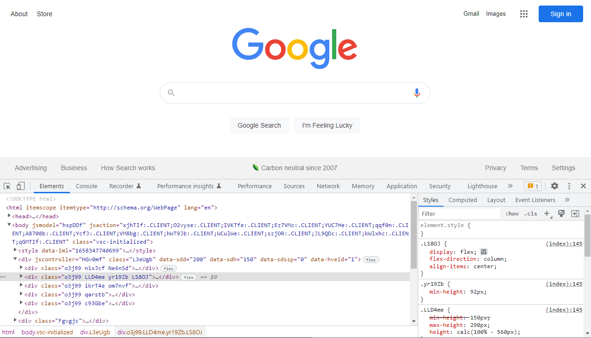

# **EAGLECORPS** [Full Stack Track](../README.md)
[back to Introduction Courses](/course/introduction.md)
# Developer Tools - Introduction Course #1 

## Course Objective:  
<em><b>Begin learning about tools for Full Stack Developers</b></em>

## Key Learning Objectives
<ul>
    <li>Learn how to inspect elements and modify code in the browser</li>
    <li>Download and use a text editor - visual studio code</li>
    <li>Download and review what a HTML5 boilerplate is</li>
    <li>Create a Github account and upload a boilerplate template</li>
    <li>Complete the first coding project and upload it to Github</li>
</ul>

### Learning Objective # 1 Download and use a text editor - visual studio code
google image here 

+ [Download Chrome Web Browser](#step1.1)
+ [Execute ChromeSetup.exe](#step1.2)
+ [Open google.com in the new Chrome browser](#step1.3)

Step 1:

Visit the  <a href="https://www.google.com/chrome/downloads/" target="_blank">Chrome Web Browser Download</a> page and select Download Chrome
  
  

Step 2:

Execute ChromeSetup.exe from downloads folder
  
  

Step 3:

Once Chrome is downloaded navigate to <a href="#" target="_blank">This Google Page (needs to be provided)</a>
  
<!-- NEED TO UPDATE IMAGE TO PROPER PROJECT URL -->
 
 

 

### Learning Objective # 2 Learn how to inspect elements and modify code in the browser  
+ [Inspect element to bring up developer tools](#step2.1)
+ [Discuss how to create an HTML element](#step2.2)
+ [Modify the HTML in browser](#step2.3)
+ [Discuss how CSS selects HTML and how property:value pairs work](#step2.4)
+ [Change CSS property:values pairs and add a few property:value pairs](#step2.5)
  

Step 1:

With the URL open, right-click and select <em>Inspect</em> to bring up the developer console, you'll notice HTML Elements on the left, and based on the element selected (highlighted in blue), you'll notice the correlating CSS on the right.
  
<!--  -->

Step 2:

Step 3:

Step 4:

Step 5:

 

 

### Learning Objective # 3 Download and review what a HTML5 boilerplate is

 

 

### Learning Objective # 4 Create a Github account and upload a boilerplate template

 

 

### Learning Objective # 5 Complete the first coding project and upload it to Github

